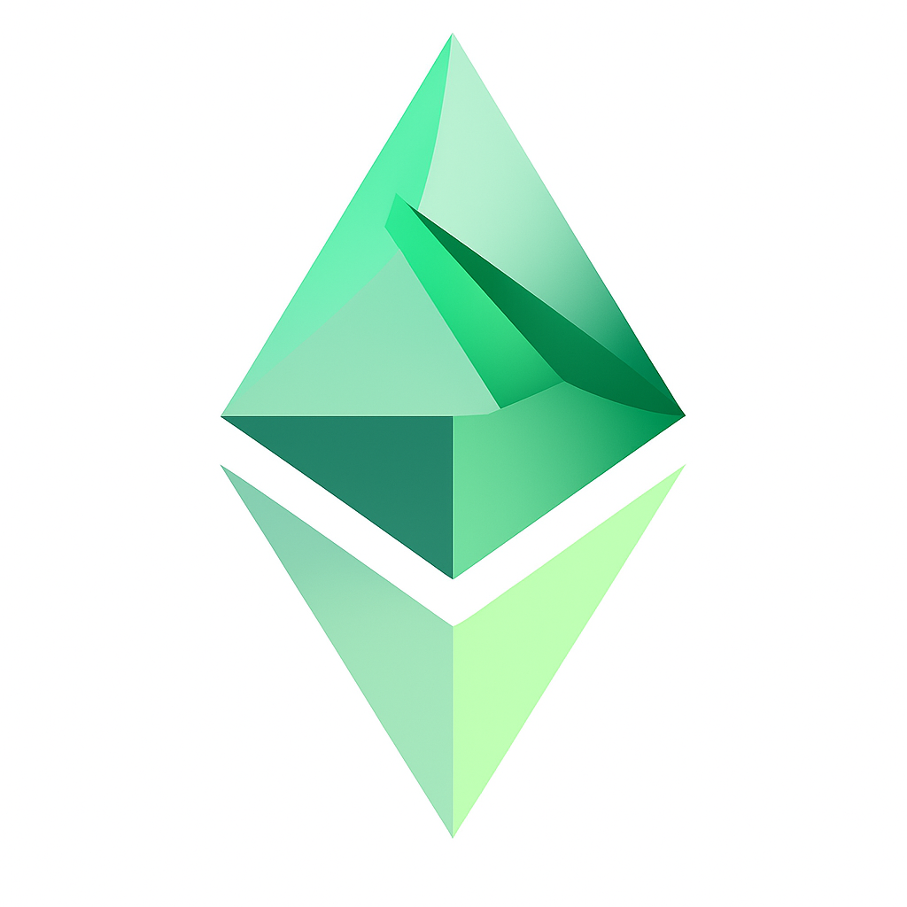

# 💎 Emerald DAO - Decentralized Real Estate Investment Platform



> **Fractionalize property ownership via blockchain technology**

## ⚠️ **EDUCATIONAL PROJECT DISCLAIMER**

**🚨 NOT FOR PRODUCTION USE 🚨**

This frontend application is **exclusively designed for educational and learning purposes**. It was created to demonstrate and explore modern Web3 development technologies including:
- React 19 & Next.js 15 with App Router
- TypeScript for type-safe blockchain interactions
- Wagmi + Viem for Ethereum integration
- Chainlink oracle technology
- DAO governance patterns
- DeFi treasury management concepts

**This project is NOT production-ready and should NEVER be used with real funds or in live environments.**

### Key Limitations:
- ❌ **No security audits** have been performed on smart contracts
- ❌ **No production testing** or stress testing completed
- ❌ **Mock data** is used extensively for demonstration
- ❌ **Educational code patterns** may not follow production best practices
- ❌ **Testnet only** - deployed on Sepolia for learning purposes

**Use this project solely for:**
- ✅ Learning Web3 development concepts
- ✅ Understanding DAO governance mechanisms  
- ✅ Exploring Chainlink oracle integration
- ✅ Studying modern React/TypeScript patterns
- ✅ Educational blockchain interaction examples

---

## 🌟 Platform Overview

**Emerald DAO** is an educational demonstration that showcases how to transform traditional real estate investment through blockchain technology. Built on Ethereum Sepolia testnet, it combines property investment, governance voting, and treasury management concepts into a unified learning platform.

**Key Educational Concepts Demonstrated:**
- **Tokenizing Properties**: Convert real estate into tradeable digital tokens
- **Democratic Governance**: ERLD token holders vote on property acquisitions and DAO decisions  
- **Automated Valuations**: Chainlink oracle integration for reliable property pricing
- **Professional Management**: Sophisticated treasury and risk management systems

### Key Statistics
- **Network**: Ethereum Sepolia Testnet
- **Token**: ERLD (Emerald) - ERC20 with governance capabilities
- **Contracts**: 7 deployed smart contracts
- **Access**: Token-gated (minimum 0.0001 ERLD required)

## 🏗️ Key Features

### 🔗 **Chainlink Oracle Integration**
- **Real-Time Property Valuations**: Live property value assessment using Chainlink oracles with multiple data source aggregation
- **Confidence Score System**: Statistical reliability metrics for each valuation with 70-100% confidence ratings
- **Historical Price Tracking**: Time-series property value data with oracle-powered trend analysis
- **Market Data Feeds**: Integration with real estate data providers for comprehensive property insights
- **Automated Valuation Updates**: Continuous property assessment with configurable refresh intervals
- **Oracle Data Visualization**: Professional charts displaying valuation history, confidence intervals, and market comparisons
- **Fallback Mechanisms**: Graceful degradation to mock data when oracle feeds are unavailable
- **Multi-Property Support**: Batch oracle queries for efficient portfolio-wide valuations

### 🏠 **Property Management System**
- **Real Estate Portfolio**: Tokenized property investments with detailed analytics and NFT-based ownership
- **Property Acquisition Workflow**: Proposal-based system for new property investments with community governance
- **ROI Tracking**: Comprehensive performance monitoring and returns analysis with yield calculations
- **Due Diligence Tools**: Detailed property information and market analysis with Chainlink-powered valuations
- **Portfolio Analytics**: Real-time metrics, appreciation tracking, and diversification insights

### 🗳️ **Governance & Voting**
- **ERLD Token Voting**: Proportional voting power based on token holdings
- **Proposal System**: Template-based proposals for different governance actions
  - Property Acquisition Proposals
  - Treasury Management Proposals  
  - Governance Parameter Changes
  - Emergency Actions
- **Delegation Support**: Delegate voting power to trusted representatives
- **Voting History**: Complete transparency of all governance decisions
- **Quorum Requirements**: Ensures legitimate community participation

### 💰 **Treasury Management**
- **Multi-Asset Treasury**: ETH and ERC20 token management
- **Health Score Monitoring**: Automated risk assessment and alerts
- **Spending Controls**: Daily and monthly withdrawal limits
- **Emergency Protections**: Circuit breakers and emergency mode activation
- **Withdrawal Proposals**: Community-governed treasury operations
- **Risk Metrics**: Real-time monitoring of treasury health and security

### 🔐 **Security & Access Control**
- **Token Gating**: ERLD token ownership required for dashboard access
- **Wallet Integration**: Seamless Web3 wallet connection via RainbowKit
- **Protected Routes**: Dashboard and sensitive operations require token verification
- **Real-time Verification**: Continuous token balance monitoring
- **Graceful Fallbacks**: Clear guidance for token acquisition

## 🛠️ Technology Stack

### **Frontend Architecture**
- **Framework**: Next.js 15 with App Router
- **Language**: TypeScript for type safety
- **Styling**: Tailwind CSS 4 with custom design system
- **Animations**: Framer Motion for smooth interactions
- **State Management**: React 19 with custom hooks

### **Web3 Integration**
- **Wallet Connection**: RainbowKit for multi-wallet support
- **Blockchain Interaction**: Wagmi + Viem for Ethereum integration
- **Contract Management**: Custom ABI definitions and typed contracts
- **Real-time Data**: Automatic contract state synchronization

### **UI/UX Components**
- **Charts & Analytics**: Recharts for data visualization
- **Icons**: Lucide React icon library
- **Responsive Design**: Mobile-first approach
- **Accessibility**: WCAG compliant components

### **Development Tools**
- **Build System**: Turbopack for fast development
- **Linting**: ESLint with Next.js configuration
- **Type Checking**: TypeScript strict mode
- **Package Management**: npm with lock files

## 📱 Component Architecture

### **Foundation Components** (`src/components/ui/`)
```
├── Button.tsx          # Variants, sizes, loading states
├── Card.tsx           # Flexible layout containers  
├── Badge.tsx          # Status indicators and labels
├── Modal.tsx          # Responsive modal dialogs
├── Input.tsx          # Form inputs with validation
├── LoadingSpinner.tsx # Loading states and skeletons
└── TokenGate.tsx      # Token verification interface
```

### **Layout System** (`src/components/layout/`)
```
├── DashboardLayout.tsx    # Main navigation and sidebar
├── PageHeader.tsx         # Page titles and breadcrumbs  
└── TokenProtectedRoute.tsx # Route-level access control
```

### **Property Management** (`src/components/property/`)
```
├── PropertyCard.tsx        # Individual property display
├── PropertyGrid.tsx        # Searchable property portfolio
└── PropertyDetailsModal.tsx # Comprehensive property analysis
```

### **Governance System** (`src/components/governance/`)
```
├── ProposalCard.tsx        # Proposal overview and voting
├── CreateProposalModal.tsx # Template-based proposal creation
└── ProposalDetailsModal.tsx # Full voting interface
```

### **Treasury Management** (`src/components/treasury/`)
```
├── TreasuryOverview.tsx      # Dashboard with charts and metrics
└── WithdrawalProposalModal.tsx # Secure fund withdrawal requests
```

## 🚀 Getting Started

### Prerequisites
- **Node.js** 18+ and npm
- **Web3 Wallet** (MetaMask, WalletConnect, etc.)
- **ERLD Tokens** (minimum 0.0001 ERLD for dashboard access)

### Installation

1. **Clone the repository**
   ```bash
   git clone <repository-url>
   cd emerald-dao-frontend
   ```

2. **Install dependencies**
   ```bash
   npm install
   ```

3. **Start development server**
   ```bash
   npm run dev
   ```

4. **Open application**
   ```
   http://localhost:3000
   ```

### Acquiring ERLD Tokens

To access the DAO dashboard, you need ERLD tokens:

1. **Connect your wallet** on the landing page
2. **Purchase ERLD tokens** via supported DEXes:
   - Uniswap V3
   - SushiSwap  
   - 1inch
3. **Minimum requirement**: 0.0001 ERLD tokens
4. **Refresh balance** and access dashboard

### Environment Setup

Create `.env.local` file:
```bash
# Optional: Custom RPC endpoints
NEXT_PUBLIC_SEPOLIA_RPC=your_sepolia_rpc_url
```

## 📖 Usage Guide

### **Connecting Your Wallet**
1. Click "Connect Wallet" on the landing page
2. Select your preferred wallet provider
3. Approve the connection request
4. Ensure you're on Sepolia testnet

### **Accessing the Dashboard**
1. Connect wallet with sufficient ERLD tokens
2. Click "Enter the DAO" or "Check Token Requirements"
3. Pass token verification (minimum 0.0001 ERLD)
4. Access full dashboard functionality

### **Creating Proposals**
1. Navigate to Governance section
2. Click "Create Proposal"
3. Choose from templates:
   - **Property Acquisition**: Propose new real estate investments
   - **Treasury Management**: Request fund allocations
   - **Governance Changes**: Modify DAO parameters
   - **Emergency Actions**: Urgent community decisions
4. Fill required details and submit

### **Voting on Proposals**
1. Browse active proposals in Governance
2. Review proposal details and discussion
3. Cast your vote: For, Against, or Abstain
4. Track voting progress and results

### **Managing Treasury**
1. View treasury overview and health metrics
2. Monitor spending limits and controls
3. Create withdrawal proposals for community approval
4. Track treasury performance and allocation

## 🔗 Smart Contract Integration

### **Deployed Contracts (Sepolia Testnet)**

| Contract | Address | Purpose |
|----------|---------|---------|
| **ERLD Token** | `0x719fCA9aED8D93b4dbE03afBD1983191C684c33d` | ERC20 governance token |
| **DAO Governance** | `0xb2dAE5da3A26551eB7DeD98815E3f3d11C974b0e` | Proposal and voting system |
| **Treasury Vault** | `0x170de1581BAE61377278A17b9D24c656Ff181a91` | Fund management and security |
| **Property Factory** | `0x81Ca034B25c8F96e7496814a30CCAbA767631ED5` | Property NFT minting |
| **Chainlink Oracle** | `0x53228D0fBD73fa84F8E48F38C33971e1F682abA2` | Property valuation data |
| **Property Acquisition** | `0x29C8a67c91cB13b715Ea4aFDF8A51ff4a40d1b05` | Investment workflow |
| **Keeper Automation** | `0xE60AD360d138FE7F33e2A373b0D7234496Ab6327` | Automated operations |

### **Contract Features**

#### **ERLD Token Contract**
- ERC20 standard with governance extensions
- Voting power delegation and tracking
- Burn mechanisms for deflationary tokenomics
- Gasless transactions via EIP-2612 permits

#### **DAO Governance Contract**
- OpenZeppelin Governor framework
- Configurable voting periods and quorum
- Proposal metadata and execution tracking
- Multi-signature execution requirements

#### **Treasury Vault Contract**
- Multi-asset support (ETH, ERC20, ERC721)
- Automated spending limits and controls
- Emergency mode and circuit breakers
- Health score monitoring and alerts

## 🏗️ Development

### **Project Structure**
```
emerald-dao-frontend/
├── src/
│   ├── app/                 # Next.js app router
│   │   ├── dashboard/       # Protected dashboard routes
│   │   └── page.tsx         # Landing page with token gating
│   ├── components/          # Reusable UI components
│   │   ├── ui/             # Foundation design system
│   │   ├── layout/         # Navigation and routing
│   │   ├── property/       # Real estate management
│   │   ├── governance/     # Voting and proposals
│   │   └── treasury/       # Financial management
│   ├── hooks/              # Custom React hooks
│   │   └── useEmeraldDAO.ts # Main DAO state management
│   ├── lib/                # Utility libraries
│   │   ├── contracts.ts    # Contract addresses and ABIs
│   │   └── wagmi.ts        # Web3 configuration
│   └── types/              # TypeScript definitions
├── public/                 # Static assets
└── package.json           # Dependencies and scripts
```

### **Available Scripts**

```bash
# Development
npm run dev          # Start development server with Turbopack
npm run build        # Create production build
npm run start        # Start production server
npm run lint         # Run ESLint checks

# Development with hot reload
npm run dev          # http://localhost:3000
```

### **Adding New Features**

1. **Create components** in appropriate directories
2. **Follow naming conventions** (PascalCase for components)
3. **Use TypeScript** for all new code
4. **Implement responsive design** with Tailwind CSS
5. **Add proper error handling** and loading states
6. **Test wallet integration** on Sepolia testnet

### **Code Style Guidelines**

- **TypeScript**: Strict mode enabled
- **Components**: Functional components with hooks
- **Styling**: Tailwind CSS utility classes
- **State Management**: React hooks and context
- **Error Handling**: Graceful fallbacks and user feedback

## 🔒 Security Considerations

> **⚠️ EDUCATIONAL DISCLAIMER: These security patterns are demonstrated for learning purposes only. This application has NOT been audited and should NEVER be used in production environments or with real funds.**

### **Educational Security Patterns Demonstrated**

#### **Access Control Concepts**
- **Token Gating**: All sensitive operations require ERLD tokens
- **Route Protection**: Dashboard routes automatically verify token ownership
- **Real-time Verification**: Continuous balance monitoring
- **Graceful Degradation**: Clear messaging for insufficient tokens

#### **Smart Contract Security Concepts** ⚠️ *Educational Only*
- **Contract Patterns**: Demonstrates security design patterns (NOT audited)
- **Spending Limits**: Educational implementation of treasury controls
- **Emergency Mechanisms**: Learning examples of circuit breakers and pause functionality
- **Governance Patterns**: Educational examples of community decision-making

#### **Frontend Security Concepts**
- **No Private Keys**: Client-side wallet integration only
- **Input Validation**: All user inputs sanitized
- **HTTPS Only**: Secure transmission requirements
- **CSP Headers**: Content Security Policy implementation

## 🤝 Contributing

We welcome contributions to Emerald DAO! Please follow these guidelines:

### **Development Process**
1. Fork the repository
2. Create feature branch (`git checkout -b feature/amazing-feature`)
3. Commit changes (`git commit -m 'Add amazing feature'`)
4. Push to branch (`git push origin feature/amazing-feature`)
5. Open Pull Request

### **Code Standards**
- Follow existing code style and conventions
- Add TypeScript types for all new code
- Include proper error handling
- Write clear, descriptive commit messages
- Test thoroughly on Sepolia testnet

### **Areas for Contribution**
- UI/UX improvements and new components
- Additional governance proposal templates
- Enhanced treasury analytics and reporting
- Mobile responsive design improvements
- Performance optimizations
- Documentation and tutorials

## 📄 License

This project is licensed under the MIT License - see the [LICENSE](LICENSE) file for details.

## 🆘 Support

### **Getting Help**
- **Documentation**: Check this README and inline code comments
- **Issues**: Report bugs via GitHub Issues
- **Discord**: Join our community Discord server //Pending
- **Twitter**: Follow [@EmeraldDAO](https://twitter.com/EmeraldDAO) for updates //Pending

### **Common Issues**
- **Token Gating**: Ensure you have minimum 0.0001 ERLD tokens
- **Network**: Verify you're connected to Sepolia testnet
- **Wallet**: Try refreshing browser or reconnecting wallet
- **Balance**: Allow time for token transfers to confirm

---

## ⚠️ **FINAL REMINDER**

**This is an educational project built for learning Web3 development concepts. DO NOT use in production or with real funds.**

---

**Built with ❤️ for educational purposes**

*Exploring Web3 development through blockchain technology*

**📚 Educational Focus:** *This project demonstrates modern Web3 development patterns, DAO governance concepts, Chainlink oracle integration, and DeFi treasury management for learning purposes only.*